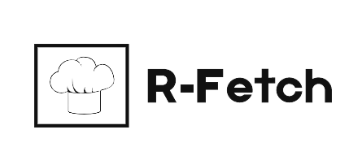

<!-- PROJECT LOGO -->
<br />
<p align="center">
  <a href="https://r-fetch.netlify.app/">
    
  </a>
  <h2 align="center">R-Fetch</h2>

A Modern Recipe Fetcher.

Built as a Mini Project For the Course - Product Definition And Validation.

 <p align="center">
    A Recipe Search Application Made with javascript.
    <br/>
    <a href="#about-the-project"><strong>Explore the docs »</strong></a>
    <br />
    <a href="https://r-fetch.netlify.app/">View Demo</a>
    ·
    <a href="https://github.com/gvssaimadhav/RFetch/issues">Report Bug</a>
  </p>
</p>

<!-- TABLE OF CONTENTS -->
<details open="open">
  <summary>Table of Contents</summary>
  <ol>
    <li>
      <a href="#about-the-project">About The Project</a>
      <ul>
        <li><a href="#built-with">Built With</a></li>
      </ul>
    </li>
    <li>
      <a href="#getting-started">Getting Started</a>
      <ul>
        <li><a href="#prerequisites">Prerequisites</a></li>
        <li><a href="#installation">Installation</a></li>
      </ul>
    </li>
    <li><a href="#usage">Usage</a></li>
    <li><a href="#roadmap">Roadmap</a></li>
    <li><a href="#contributing">Contributing</a></li>
    <li><a href="#acknowledgements">Acknowledgements</a></li>
  </ol>
</details>

<!-- ABOUT THE PROJECT -->

## About The Project

[![Product Name Screen Shot][product-screenshot]](https://r-fetch.netlify.app/)

R-Fetch is a Vanilla JS application that interacts with the Forkify API to fetch and display recipe food data. <br>
This app uses modern JavaScript tools, such as Webpack to bundle the modules, and Babel to convert ES6, ES7 and ES8 back to ES5.<br>
The user can search for a specific recipe, and save to a favorites list via local storage.<br>
The user can easily increase or decrease servings as per his need and can view detailed directions. <br>

## Built With

This app is built with pure Vanilla JS along with HTML and SCSS. It uses Webpack as module bundler and NPM as package manager.

- [HTML](https://developer.mozilla.org/en-US/docs/Web/HTML)
- [SCSS](https://sass-lang.com/)
- [JavaScript](https://developer.mozilla.org/en-US/docs/Web/javascript)
- [Webpack](https://webpack.js.org/)
- [NPM](https://www.npmjs.com/)

<!-- GETTING STARTED -->

## Getting Started

To get started with project just simply fork this repo or download locally on your System.

To get a local copy up and running follow these simple example steps.

### Prerequisites

Start with the latest version of NPM to avoid any errors:

- npm
  ```sh
  npm install npm@latest -g
  ```

### Installation

1. Get a free API Key at [Forkify API_KEY](https://forkify-api.herokuapp.com/v2)
2. Clone the repo
   ```sh
   git clone https://github.com/gvssaimadhav/RFetch.git
   ```
3. Install NPM packages
   ```sh
   npm install
   ```
4. Enter your API in `config.js`
   ```JS
   const KEY = 'ENTER YOUR API';
   ```

<!-- USAGE EXAMPLES -->

## Usage

1. The Forkify Recipe App allows users to search for recipes.

2. Users can view the recipe along with the cook time and also
   increase or decrease the amount of servings they need.

3. Bookmarked recipes are stored in local storage so no database was
   required for this application.

_For more examples, please refer to the [Documentation](https://forkify-api.herokuapp.com/v2)_

<!-- ROADMAP -->

## Roadmap

See the [open issues](https://github.com/gvssaimadhav/RFetch/issues) for a list of proposed features (and known issues).

<!-- CONTRIBUTING -->

## Contributing

Contributions make the Open Source Community such an Amazing place to Learn, Inspire, And Create. <br>
Any contributions you make are **greatly appreciated**.

1. Fork the Project
2. Create your Feature Branch (`git checkout -b feature/AmazingFeature`)
3. Commit your Changes (`git commit -m 'Add some AmazingFeature'`)
4. Push to the Branch (`git push origin feature/AmazingFeature`)
5. Open a Pull Request

<!-- CONTACT -->

## Contact

GVS Sai Madhav - [Say Hi](https://gvssmadhav.tech)

Project Link: [https://github.com/gvssaimadhav/RFetch](https://github.com/gvssaimadhav/RFetch)

<!-- ACKNOWLEDGEMENTS -->

## Acknowledgements

- [Img Shields](https://shields.io)
- [Netlify](https://www.netlify.com/)
- [Webpack](https://webpack.js.org/)
- [Google Fonts](https://fonts.google.com/)

<!-- MARKDOWN LINKS & IMAGES -->
<!-- https://www.markdownguide.org/basic-syntax/#reference-style-links -->

[product-screenshot]: ./src/img/screenshot.jpg
